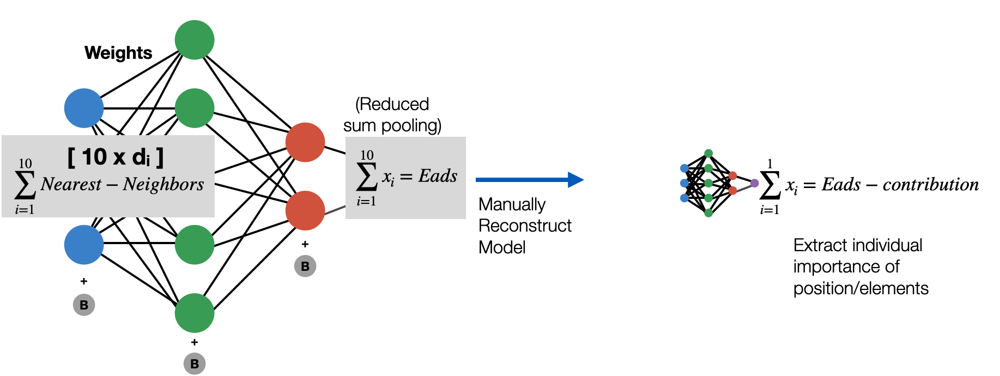

# Neural-Network-Decomposition-Algorithm
This repository provides the code used for my publication "Machine-Learning-Driven High-Entropy Alloy Catalyst Discovery to Circumvent the Scaling Relation for CO2 Reduction Reaction"
ACS Catal. 2022, 12, 24, 14864–14871 (https://doi.org/10.1021/acscatal.2c03675)

Table of Contents
=================

<!--ts-->
   * [Scientific content](#scientific-content)
   * [Data science and ML content](#data-science-and-ML-content)
      * [Transferable feature engineering](#transferable-feature-engineering)
      * [Neural network decomposition](#neural-network-decomposition)
      * [Empirically driven design](#empirically-driven-design)
   * [Usage](#usage)
   * [Code structure](#code-structure)
      * [File contents](#file-contents)
      * [Package dependencies](#package-dependencies)
<!--te-->

Scientific content
==================

The work provides a first ever look into the intermediate rotation mechanic observed on HEAs that allows them to break the BEP linear scaling relation.

     

Data science and ML content
===============================
Transferable feature engineering 
--------------------------------
Using the local chemical environments of each datapoints as a starting point, an atomic embedding is performed where various chemical, quantum and spatial descriptors  are applied to each atom and concatenated to formulate tensors for training. This feature engineering approach can be applied to any size system and extracted from any standard ASE db or SQL db if the geometric structure is provided.

Neural network decomposition
----------------------------
This mechanic was elucidated through a Neural Network decomposition and spatial averaging technique visualized below. In short, the technique extracts the weights/bias of the model and outputs the indiviudal atomic contributions learned from training in an easily interpretable way.

     

2RR catalytic surfaces in computational literature. The key lies in splitting key potential limiting steps into smaller steps through rotational reconfiguration. 

     

     
</p

2: 'Visualization_and_exploration_of_dataset' is a supplementary notebook providing data visualization for the figures provided in the publication.

3: 'helpers.py' is a python file with a class for feature embedding and the NN decomposition.

4: 'All_data.csv' and 'site_infs.csv' contain the raw dataset data generated through DFT and neural generators.

Package dependencies
--------------------
- Numpy
- Pandas
- Matplotlib
- Seaborn
- TensorFlow/Keras
- Sklearn
