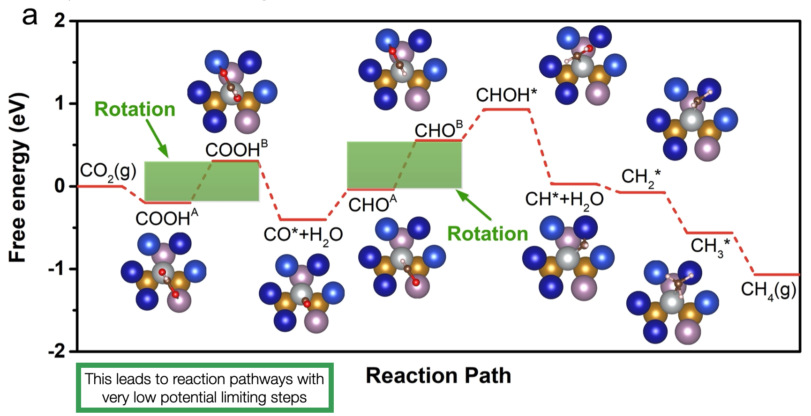

# Neural-Network-Decomposition-Algorithm
This repository provides the code used for my publication "Machine-Learning-Driven High-Entropy Alloy Catalyst Discovery to Circumvent the Scaling Relation for CO2 Reduction Reaction"
ACS Catal. 2022, 12, 24, 14864–14871 (https://doi.org/10.1021/acscatal.2c03675)

This notebook provides a first ever look into the intermediate rotation mechanic observed on HEAs.

     

This mechanic is then used as a design principle to create some of the best CO2RR catalytic surfaces in computational literature. The key lies in splitting key potential limiting steps into smaller steps through rotational reconfiguration. 

     
</p

There are 2 notebooks and accompanying files/datasets in this repository:

1: 'Neural_Net_Decomposition_Method'is the main notebook outlining how to train a basic NN model with TF, extract internal weights, and perform a NN decomposition outlined in the publication.

2: 'Visualization_and_exploration_of_Dataset' is a supplementary notebook providing data visualization for the figures provided in the publication.

3: 'helpers.py' is a python file with a classes for feature embedding and the NN decomposition.

4: 'All_data.csv' and 'site_infs.csv' contain the raw dataset data generated through DFT and neural generators.

Required Python Packages to run the code:
pandas,
numpy,
matplotlib,
seaborn,
math,
tensorflow,
sklearn
